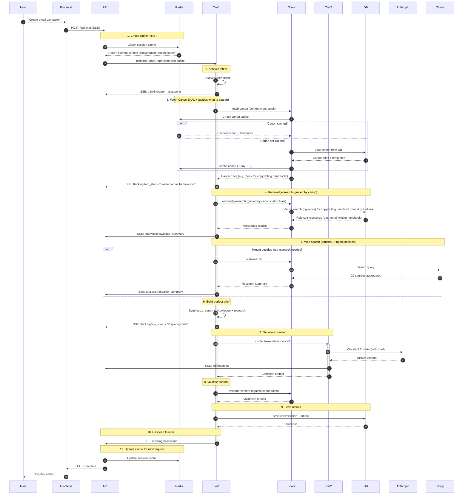

# 🏗️ MarketerX Backend Architecture V2.0
## Complete System Architecture & Technical Stack

## 📋 Executive Summary

This document outlines the complete backend architecture for MarketerX, a two-tier AI-powered content generation platform. The system uses:

- **Two-Tier Agent Architecture** - Strategic orchestration (Tier 1) + Specialized execution (Tier 2)
- **LangGraph for Orchestration** - Explicit state management, branching, resumability
- **Anthropic & OpenAI SDKs** - Direct model control without agent abstraction overhead
- **SSE Streaming** - Real-time updates to frontend
- **Supabase** - Database, pgvector for semantic search
- **Tavily** - Real-time web search optimized for AI
- **Redis** - Caching for performance optimization

### Key Architectural Decisions

| Decision | Rationale |
|----------|-----------|
| **LangGraph over LangChain** | Explicit state management, no hidden orchestration, better observability |
| **Standard SDKs over Agent SDKs** | Direct control, lower overhead, better performance |
| **Tavily over Perplexity** | Optimized for AI agents, aggregates 20+ sources per call |
| **Two-Tier Design** | Context efficiency, cost optimization, specialized models |
| **Model Selection UI** | User picks model by task (like Cursor), enables tiered pricing |

---
## 🧠 Two-Tier Architecture Deep Dive

### Tier 1: Strategic Orchestrator (The Brain)

**Purpose:** User-facing agent that manages conversation, makes decisions, calls tools

**Model:** Claude 4.5 Sonnet (reasoning optimized)

**Framework:** LangGraph with state management

**Responsibilities:**
1. Understand user intent
2. Maintain conversation context (100+ messages)
3. Decide which tools to call and when
4. Call Tier 2 for content generation
5. Synthesize results and respond to user
6. Stream SSE events to frontend

**SSE Events Emitted:**
- `thinking/agent_reasoning` - Strategic thinking
- `thinking/tool_status` - Tool execution updates
- `analysis/research_summary` - Research insights
- `message/assistant` - Chat response

---

### Tier 2: Content Execution (The Hands)

**Purpose:** Specialized writing agent, completely stateless

**Models:**
- Claude 4.5 Haiku (fast, cost-effective)
- GPT-4o-mini (alternative for variety)

**Wrapped As:** `content-execution` TOOL

**Responsibilities:**
1. Receive perfect brief from Tier 1
2. Write content following templates
3. Return structured artifact with XML markers
4. No conversation memory

**SSE Events Emitted:**
- `artifact/start` - Begin generation
- `artifact/delta` - Stream content chunks
- `artifact/end` - Completion

---

## 🔧 Technical Stack

### Backend Core

| Component | Technology | Version | Justification |
|-----------|-----------|---------|---------------|
| **Runtime** | Node.js | 20.x LTS | Best ecosystem for LangGraph, SSE, async |
| **Framework** | Fastify | 4.x | Faster than Express, native SSE support |
| **Language** | TypeScript | 5.x | Type safety, better DX |
| **Orchestration** | LangGraph | Latest | Explicit state, branching, resumability |
| **Process Manager** | PM2 | Latest | Clustering, zero-downtime restarts |

### LLM Integration

| Component | Technology | Justification |
|-----------|-----------|---------------|
| **Tier 1 Model** | Claude 4.5 Sonnet | Best reasoning, tool use, long context (200K) |
| **Tier 2 Models** | Claude 4.5 Haiku<br/>GPT-4o-mini | Fast, cost-effective, good writing quality |
| **SDK** | Anthropic SDK<br/>OpenAI SDK | Direct control, no abstraction overhead |
| **Embeddings** | text-embedding-3-large | Best performance for semantic search |

### Data & Storage

| Component | Technology | Justification |
|-----------|-----------|---------------|
| **Database** | Supabase (PostgreSQL 15) | Existing setup, scalable, real-time |
| **Vector Search** | pgvector | Built into Postgres, no separate DB needed |
| **File Storage** | Supabase Storage | Integrated with DB, handles business resources |
| **Cache** | Redis (Upstash) | Serverless Redis, Railway integration |

### Tools & Services

| Tool | Provider | Purpose |
|------|----------|---------|
| **Web Search** | Tavily | Real-time search, optimized for AI (20 sources/call) |
| **Observability** | LangSmith | LLM tracing, debugging, evaluations |
| **Monitoring** | Railway Metrics | Infrastructure monitoring, logs |
| **Embeddings** | OpenAI | text-embedding-3-large for knowledge search |

### Caching Strategy

| Layer | Technology | TTL | Purpose |
|-------|-----------|-----|---------|
| **Prompt Cache** | Anthropic Native | 5 min | Cache system prompts, templates (90% cost reduction) |
| **Session Cache** | Redis | 30 min | User context, conversation state |
| **Knowledge Cache** | Redis | 24 hours | Vector search results for common queries |
| **Canon Cache** | Redis | 7 days | Brand guidelines, templates (rarely change) |
| **HTTP Cache** | Fastify | 5 min | Static resources, canon definitions |

---

## 📊 Component Interaction Flow

### Complete User Request Flow



### Flow Explanation: Cache-First, Canon-Guided Architecture

**Key Architectural Decisions:**

1. **Cache Check First (Step 1-2)**
   - Before ANY tool calls, check Redis for cached conversation context and recent canon
   - Reduces latency and unnecessary API calls
   - Warm cache = instant context restoration

2. **Fetch Canon Early (Step 3)**
   - Canon is loaded **immediately after** intent analysis
   - **Why:** Canon acts as the "instruction manual" that tells the agent what to look for
   - **Example:** User says "create email" → Canon says "look for copywriting handbook for email best practices"
   - Cached for 7 days (changes rarely)

3. **Knowledge Search Guided by Canon (Step 4)**
   - Agent now knows exactly what resources to search for (thanks to canon)
   - More targeted vector search = better results
   - **Example:** Instead of generic search, specifically looks for "copywriting handbook" or "email guidelines"

4. **Web Search Optional (Step 5)**
   - Only executed if agent determines it's needed
   - Not every request requires real-time web data
   - Controlled by agent's reasoning

5. **Brief Synthesis (Step 6)**
   - Agent combines: Canon rules + Knowledge results + Web research (if any)
   - Creates perfect, comprehensive brief for Tier 2

**Why This Order Matters:**

```
❌ Old Flow:
User → Intent → Search → Web → Canon → Brief
Problem: Searching blindly without knowing what to look for

✅ New Flow:  
User → Cache Check → Intent → Canon → Guided Search → Brief
Benefit: Canon instructs what to search for, more efficient and relevant
```

**Performance Impact:**
- **Cache hit:** Skip steps 3-4 entirely (80% faster)
- **Canon cached:** Save 7-day TTL lookup every time
- **Guided search:** More accurate results, fewer follow-up searches

---

### Core API Contracts

#### POST /api/v1/chat/stream

**Request:**
```typescript
interface ChatStreamRequest {
  conversationId?: string;  // Optional, creates new if not provided
  message: string;
  modelPreference?: {
    tier1: "claude-3-5-sonnet-20241022";
    tier2: "claude-3-5-haiku-20241022" | "gpt-4o-mini";
  };
  context?: {
    includeResources?: string[];  // Resource IDs to include
    enableWebSearch?: boolean;
    enableCodeExecution?: boolean;
  };
}
```

**Response (SSE Stream):**
```typescript
// Event types
type SSEEvent = 
  | ThinkingEvent
  | AnalysisEvent
  | ArtifactEvent
  | MessageEvent
  | ErrorEvent;

interface ThinkingEvent {
  event: "thinking";
  data: {
    type: "agent_reasoning" | "tool_status";
    content: string;
    metadata?: Record<string, any>;
  };
}

interface ArtifactEvent {
  event: "artifact";
  data: {
    type: "start" | "delta" | "end";
    artifactId: string;
    content?: string;  // For delta/end
    metadata?: {
      contentType: string;
      wordCount?: number;
    };
  };
}

interface MessageEvent {
  event: "message";
  data: {
    role: "assistant";
    content: string;
    messageId: string;
  };
}
```

**Example Stream:**
```
event: thinking
data: {"type":"agent_reasoning","content":"I'll search your brand guidelines and create an email campaign..."}

event: thinking
data: {"type":"tool_status","content":"Searching knowledge base...","tool":"knowledge-search"}

event: artifact
data: {"type":"start","artifactId":"art_123","metadata":{"contentType":"email"}}

event: artifact
data: {"type":"delta","artifactId":"art_123","content":"Subject: Transform Your..."}

event: artifact
data: {"type":"end","artifactId":"art_123","metadata":{"wordCount":350}}

event: message
data: {"role":"assistant","content":"I've created an email campaign based on your guidelines...","messageId":"msg_456"}

event: done
data: {"conversationId":"conv_789","messageCount":12}
```


---

## 🧰 Tools Architecture

### Tool Definitions for Tier 1

```typescript
const toolDefinitions = [
  {
    name: "web-search",
    description: "Search the web for real-time information using Tavily",
    inputSchema: {
      type: "object",
      properties: {
        query: { type: "string", description: "Search query" },
        maxResults: { type: "number", default: 10 },
        searchDepth: { 
          type: "string", 
          enum: ["basic", "advanced"],
          description: "basic=5 sources, advanced=20 sources"
        }
      },
      required: ["query"]
    }
  },
  
  {
    name: "knowledge-search",
    description: "Search user's business resources using semantic search",
    inputSchema: {
      type: "object",
      properties: {
        query: { type: "string" },
        topK: { type: "number", default: 5 },
        resourceTypes: { 
          type: "array", 
          items: { type: "string" }
        }
      },
      required: ["query"]
    }
  },
  
  {
    name: "knowledge-fetch",
    description: "Retrieve full content of a specific resource by ID",
    inputSchema: {
      type: "object",
      properties: {
        resourceId: { type: "string" }
      },
      required: ["resourceId"]
    }
  },
  
  {
    name: "fetch-canon",
    description: "Load proprietary frameworks, templates, and compliance rules",
    inputSchema: {
      type: "object",
      properties: {
        category: { 
          type: "string",
          enum: ["template", "framework", "compliance", "all"]
        },
        contentType: { 
          type: "string",
          enum: ["email", "ad", "landing-page", "script"]
        }
      },
      required: ["category", "contentType"]
    }
  },
  
  {
    name: "content-execution",
    description: "Generate content using specialized writing agent (Tier 2)",
    inputSchema: {
      type: "object",
      properties: {
        contentType: { 
          type: "string",
          enum: ["email", "ad", "landing-page", "script"]
        },
        objective: { type: "string" },
        targetAudience: { type: "string" },
        brandGuidelines: { type: "string" },
        templates: { type: "array" },
        complianceRules: { type: "array" },
        research: { type: "string" },
        tone: { type: "string" }
      },
      required: ["contentType", "objective", "targetAudience"]
    }
  },
  
  {
    name: "validate-content",
    description: "Check content against compliance rules and brand guidelines",
    inputSchema: {
      type: "object",
      properties: {
        content: { type: "string" },
        rules: { type: "array" }
      },
      required: ["content", "rules"]
    }
  },
];
```

---

## 📦 Implementation Checklist

### Phase 1: Core Infrastructure (Week 1)

- [ ] Set up Railway project with Node.js 20
- [ ] Configure Supabase connection + pgvector extension
- [ ] Set up Redis (Upstash) for caching
- [ ] Implement API framework (Fastify + SSE)
- [ ] Set up environment variables & secrets

### Phase 2: LangGraph Orchestration (Week 2)

- [ ] Implement LangGraph state machine for Tier 1
- [ ] Define all tool schemas
- [ ] Create tool execution functions
- [ ] Implement Anthropic SDK integration
- [ ] Add prompt caching for system prompts
- [ ] Build SSE streaming pipeline
- [ ] Add conversation state management

### Phase 3: Tool Integration (Week 3)

- [ ] Integrate Tavily Search API
- [ ] Build knowledge search with pgvector
- [ ] Create embedding pipeline (OpenAI)
- [ ] Implement canon loader (templates/rules)
- [ ] Add content validation tool
- [ ] Test all tools end-to-end

### Phase 4: Tier 2 Content Execution (Week 4)

- [ ] Build Tier 2 stateless agent
- [ ] Implement content templates
- [ ] Add artifact generation with XML markers
- [ ] Stream artifact deltas via SSE
- [ ] Support multiple content types

### Phase 5: Caching & Performance (Week 5)

- [ ] Implement Redis session caching
- [ ] Add knowledge search result caching
- [ ] Configure Anthropic prompt caching
- [ ] Add canon/template caching (7 day TTL)
- [ ] Optimize database queries
- [ ] Set up connection pooling
- [ ] Load testing & optimization

### Phase 6: Observability & Monitoring (Week 6)

- [ ] Integrate LangSmith tracing
- [ ] Set up Railway monitoring
- [ ] Create custom metrics endpoint
- [ ] Implement error tracking
- [ ] Build usage analytics
- [ ] Add cost tracking per user
- [ ] Create admin dashboard

### Phase 7: Model Selection & Credits (Week 7)

- [ ] Implement user tier system
- [ ] Build model selection API
- [ ] Add credit calculation logic
- [ ] Create credit consumption tracking
- [ ] Implement rate limiting by tier
- [ ] Test credit deduction flow

---

## 📚 Key Resources & Documentation

### Official Documentation
- [LangGraph Docs](https://langchain-ai.github.io/langgraph/)
- [Anthropic API Reference](https://docs.anthropic.com/en/api/messages)
- [Tavily API Docs](https://docs.tavily.com/)
- [E2B Documentation](https://e2b.dev/docs)
- [Supabase pgvector Guide](https://supabase.com/docs/guides/ai/vector-columns)

### Tools & Services
- **Anthropic**: https://console.anthropic.com/
- **OpenAI**: https://platform.openai.com/
- **Tavily**: https://app.tavily.com/
- **E2B**: https://e2b.dev/
- **LangSmith**: https://smith.langchain.com/
- **Railway**: https://railway.app/
- **Supabase**: https://supabase.com/
- **Upstash Redis**: https://upstash.com/

---